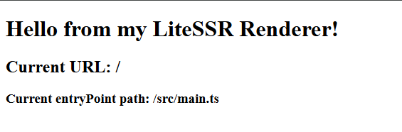

# Создание собственного генератора  

:::info  
Хотя корректным термином было бы **рендерер** (от англ. *Renderer*), мы будем использовать термин **генератор**, чтобы избежать путаницы из-за языковых нюансов.  
:::  

---

## Что такое генератор?  

**Генератор (Renderer)** — это [абстрактный класс](https://github.com/DanteZZ/lite-ssr/blob/main/packages/core/src/common/Renderer.ts), который отвечает за генерацию итоговой HTML-разметки. С его помощью можно расширять функционал **lite-ssr**, добавляя поддержку новых фреймворков или реализуя собственные подходы к генерации HTML.  

### Основные методы генератора  

Сервер **lite-ssr** использует три ключевых метода генератора:  

1. **`generateHtml(url, template)`**  
   Асинхронный метод, который принимает URL и шаблон, возвращая итоговую HTML-разметку.  

2. **`getHtmlTemplate()`**  
   Метод возвращает стандартный шаблон (если требуется) в виде строки. Если пользователь переопределяет шаблон в конфигурации (`lssr.config.ts`), то этот метод игнорируется.  

3. **`initializePlugins()`**  
   Метод инициализирует [renderer-плагины](./creating-renderer-plugins.md), подключенные в конфигурации.  

### Абстрактные обязательные методы  

1. **`renderApp(url)`**  
   Основной метод для рендеринга приложения в HTML.  

2. **`getInitialState()`**  
   Возвращает объект с начальными данными, которые нужны для гидрации приложения на клиенте.  

Эти методы обязательны для реализации, что упрощает и стандартизирует процесс создания генераторов.  

---

## Создание собственного генератора  

Давайте рассмотрим, как создать собственный генератор. Мы будем использовать подход, при котором генератор оформляется в виде отдельного пакета.  

---

### Шаг 1. Подготовка проекта  

1. Создайте новый проект Node.js с поддержкой TypeScript. Используйте Node.js версии 20.17 или выше и менеджер пакетов `pnpm`.  

2. Настройте `tsconfig.json` следующим образом:  
<details>
<summary>Пример tsconfig.json</summary>

```json
{
  "compilerOptions": {
    "target": "ESNext",
    "module": "NodeNext",
    "moduleResolution": "NodeNext",
    "outDir": "dist",
    "declaration": true,
    "strict": true,
    "esModuleInterop": true,
    "skipLibCheck": true,
    "forceConsistentCasingInFileNames": true,
    "sourceMap": true
  },
  "include": ["src/**/*"],
  "exclude": ["node_modules", "dist"]
}
```
</details>  

3. Установите пакет `@lite-ssr/core`:  
   ```bash  
   pnpm install @lite-ssr/core  
   ```  

4. Создайте файл `src/index.ts` для экспорта вспомогательных функций:  
   ```typescript  
   export function customFunction() {
       return true;
   }
   ```  

:::info  
Функции, которые могут быть выполнены на стороне клиента, экспортируйте из корня библиотеки. Сам генератор экспортируйте из отдельного файла, так как его функционал предназначен для работы на стороне сервера.  
:::  

---

### Шаг 2. Реализация генератора  

1. Создайте файл `src/renderer.ts` и реализуйте генератор:  

```typescript  
import { Renderer } from '@lite-ssr/core';  

export class CustomRenderer extends Renderer {  
    async renderApp(url: string): Promise<string> {  
        const html = `<div id="app">` +  
                     `<h1>Hello from my LiteSSR Renderer!</h1>` +  
                     `<h2>Current URL: ${url}</h2>` +  
                     `<h3>Current entryPoint path: ${this.entryPoint}</h3>` +  
                     `</div>`;  
        return html;  
    }  

    getInitialState() {  
        return {  
            customProperty: {},  
        };  
    }  
}
```  

Этот пример демонстрирует минимальную реализацию генератора.  

---

### Шаг 3. Настройка package.json  

Добавьте настройки для корректной работы пакета:  

```json  
{
  "name": "my-lssr-renderer",
  "main": "dist/index.js",
  "types": "dist/index.d.ts",
  "type": "module",
  "exports": {
    ".": "./dist/index.js",
    "./renderer": "./dist/renderer.js"
  },
  "scripts": {
    "build": "tsc",
    "prepublishOnly": "tsc"
  }
}
```  

---

### Шаг 4. Сборка проекта  

Соберите проект:  
```bash  
pnpm build  
```  

---

## Подключение генератора в проект  

1. Установите пакет вашего генератора в проект с **lite-ssr**.  
2. Подключите генератор в `lssr.config.ts`:  

```typescript  
import { defineLssrConfig } from 'lite-ssr';  
import { CustomRenderer } from 'my-lssr-renderer/renderer';  

export default defineLssrConfig({  
    renderer: CustomRenderer,  
    entry: '/src/main.ts'  
});
```  

3. Запустите сервер разработки:  
```bash  
pnpm dev  
```  

Теперь ваш генератор будет генерировать HTML, как указано в его реализации.  

---

## Результат  

После запуска проекта вы увидите в браузере:  

  

А в исходном коде страницы:  

```html  
<!DOCTYPE html>
<html>
  <head>
    <script type="module" src="/@vite/client"></script>
  </head>
  <body>
    <div id="app">
        <h1>Hello from my LiteSSR Renderer!</h1>
        <h2>Current URL: /</h2>
        <h3>Current entryPoint path: /src/main.ts</h3>
    </div>
    <script>window.__INITIAL_STATE__="{\"customProperty\":{}}"</script>
    <script type="module" src="/src/main.ts"></script>
  </body>
</html>
```  

Поздравляем! Ваш генератор успешно работает.  

--- 